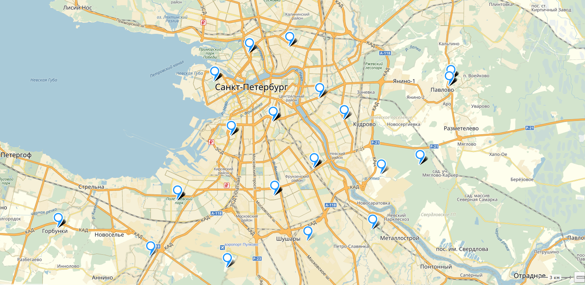
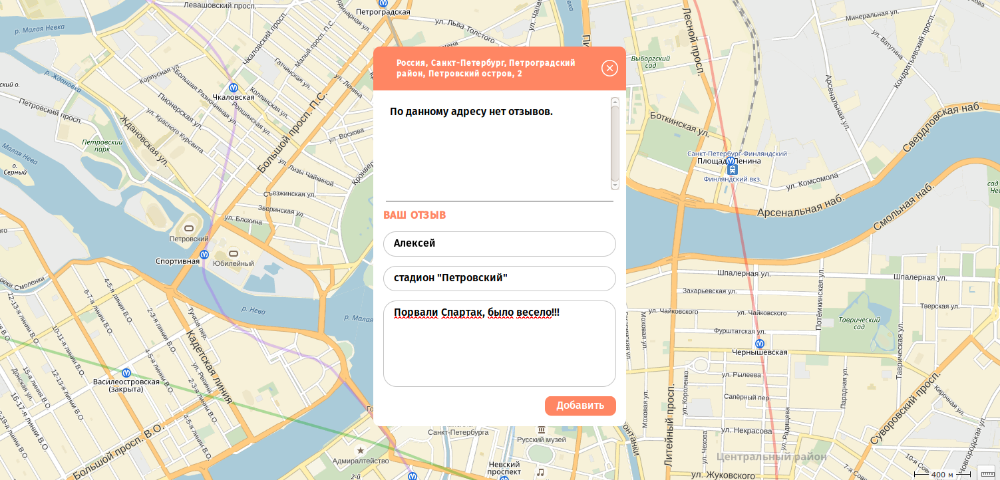

# Приложение Геоотзыв

## Описание

Приложение позволяет оставлять отзывы о местах в которых вы побывали.

Сервис разрабатывался с целью изучения API Яндекс карт.

## Как использовать

После того как приложение выведет карту на экран, вы сможете оставить свой отзыв используя всплывающее окно.

Для этого нужно кликнуть по карте и заполнить все поля в появившемся окне.

## Как скачать проект

Перед тем как скачать проект убедитесь, что у вас установлены

*   [Node.js](https://nodejs.org/)
*   [NPM](https://www.npmjs.com/)
*   [Gulp](http://gulpjs.com/)

### Скачивание

В терминале перейдите в папку в которую будет скачиваться проект. После чего наберите команды

*   git clone https://github.com/AlexeyErofeyev/GeoFeedback.git
*   cd GeoFeedback
*   npm install

### Запуск проекта

Для запуска проекта нужно открыть два терминала

В первом терминале, перейдя в папку с проектом наберите команду node server.js

Во втором терминале, перейдя в папку с проектом наберите команду gulp

Проект сам запустится и откроется в браузере